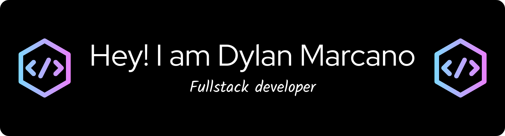

---

# 💫 About Me:
I'm a Computer Science Student I'm Software Developer I'm Venezuelan.

## 🌐 Socials:
         

# 💻 Tech Stack:
          
# 📊 GitHub Stats:
 
 

### ✍️ Random Dev Quote

---

  ## 💰 You can help me by Donating
     

  
<!-- Proudly created with GPRM ( https://gprm.itsvg.in ) -->
